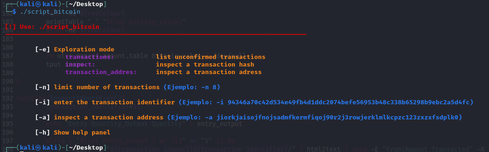
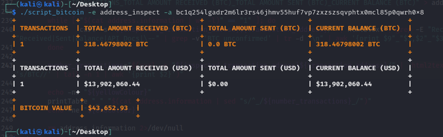

# BTC-Analyzer

**BTC-Analyzer** constituye una herramienta desarrollada en Bash diseñada específicamente para examinar transacciones en el servicio de exploración de bloques de Bitcoin, reconocido como Blockchain (blockchain.com).

¿Te gustaría descubrir cuánto dinero fluye a nivel mundial? Algunas transacciones pueden sorprenderte.

# Requisitos previos

Antes de ejecutar la herramienta, asegúrate de instalar las siguientes utilidades a nivel de sistema:

```bash
apt install html2text bc -y
chmod +x script_bitcoin
```
Una vez que hayas completado la instalación, podrás avanzar al siguiente paso.

# Instrucciones de Uso
Al ejecutar la herramienta, se presentará la siguiente interfaz:

<p align="center">

</p>

btcAnalyzer ofrece tres modos de exploración:

* unconfirmed_transactions
* inspect
* address_inspect

La primera opción permite listar las transacciones en tiempo real, permitiendo especificar el número total de transacciones a través del parámetro '-n':

<p align="center">

</p>

Si deseas examinar una transacción en particular, proporciona su identificador utilizando el modo 'inspect', revelando las direcciones de entrada y salida. Utiliza el parámetro '-i' seguido del identificador de la transacción:

<p align="center">

</p>

En la actualidad, las direcciones de entrada y salida se filtran en la primera página. Si una transacción involucra múltiples direcciones, a veces estas pueden encontrarse en otras páginas. Si alguien desea mejorar esta funcionalidad para capturar todas las direcciones, se puede realizar mediante un pull request.

Para investigar las direcciones involucradas en una transacción, ya sea de entrada o salida, utiliza el modo 'address_inspect' con el parámetro '-a' seguido de la dirección que deseas explorar:

<p align="center">

</p>

Este código puede copiarse directamente en un documento Markdown para una fácil referencia.
